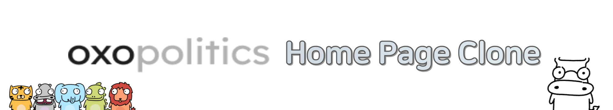

<h1>oxopolitics Clone입니다!</h1>

### Description of Project

<b>Why?</b>  
3명의 팀원들 모두 React를 처음 접하거나 접한지 얼마 되지 않았기 때문에,   React와 좀 더 친해지기 위한 프로젝트이다.

<b>What?</b>  
<a href="https://www.oxopolitics.com/">옥소폴리틱스</a>의 Home Page를 보고 클론 코딩을 진행하였다.   이 때, JSON 파일로 Page에 대한 정보를 가공하여 화면에 나타나도록 하였다.

### Tech Stacks

<!-- JavaScript -->

<!-- React -->

<!-- Vite -->

<!-- Styled Components -->

### Crew Info

| TEAM                                | Position | Blog                                                      | Github                                                     |
| ----------------------------------- | -------- | --------------------------------------------------------- | ---------------------------------------------------------- |
| :wink: 이소윤 | FrontEnd | <a href="https://programmerplum.tistory.com/">tistory</a> | <a href="https://github.com/99dlthdbs">@99dlthdbs</a>      |
| :sunglasses: 이기문                 | FrontEnd | <a href="https://velog.io/@kimoon212">velog</a>           | <a href="@kimoon1 ">@kimoon1</a>                           |
| :laughing: 정영훈                   | FrontEnd | <a href="https://youngst.tistory.com/7">tistory</a>       | <a href="https://github.com/young-st511">@young-st5111</a> |

